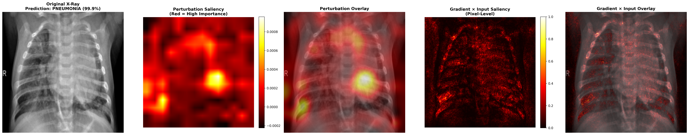

# Saliency Maps for Pneumonia Classification

This project demonstrates how **Saliency Maps** can be used to interpret deep learning models in **computer vision**, specifically for **Pneumonia detection from Chest X-Ray images**.

The model classifies X-ray scans as **Pneumonia** or **Normal** and highlights the most important regions influencing the prediction using saliency visualization.

---

## 📌 Project Overview

- Train a CNN model on Chest X-Ray images
- Perform Pneumonia classification
- Generate Saliency Maps for model interpretability
- Visualize which lung regions influence predictions

This helps in making AI predictions more explainable for medical imaging tasks.

---

## Installation

Follow these steps to set up the project locally.

### Clone the Repository

```bash
git clone https://github.com/bhatishan2003/saliency-maps-in-computer-vision.git
cd saliency-maps-in-computer-vision.git
```

---

### Install Dependencies

```bash
pip install -r requirements.txt
```

---

### How to Run

Run the pneumonia classification script using:

```bash
python pneumonia_lassification.py
```

```bash
Epoch 19/25
--------------------------------------------------
Training: 100%|██████████████████████████████████████████████████████████████████████████████████████████████████████| 164/164 [08:23<00:00,  3.07s/it, acc=97.29%, loss=0.0379]
Validation: 100%|██████████████████████████████████████████████████████████████████████████████████████████████████████| 20/20 [00:50<00:00,  2.51s/it, acc=78.69%, loss=0.0010]

Train Loss: 0.0691 | Train Acc: 97.29%
Val   Loss: 1.0019 | Val   Acc: 78.69%
Val Precision: 0.7476 | Recall: 0.9949 | F1: 0.8537

Epoch 20/25
--------------------------------------------------
Training: 100%|██████████████████████████████████████████████████████████████████████████████████████████████████████| 164/164 [08:03<00:00,  2.95s/it, acc=97.71%, loss=0.1292]
Validation: 100%|██████████████████████████████████████████████████████████████████████████████████████████████████████| 20/20 [00:53<00:00,  2.66s/it, acc=85.42%, loss=0.0096]

Train Loss: 0.0597 | Train Acc: 97.71%
Val   Loss: 0.6396 | Val   Acc: 85.42%
Val Precision: 0.8229 | Recall: 0.9769 | F1: 0.8933
```

## Result

## 🖼️ Sample Output

Final Saliency Map visualization:

- The saliency map highlights the regions of the chest X-ray that most influenced the model’s pneumonia prediction. Warmer colors (red/yellow) indicate higher importance, showing the lung areas the CNN focused on for classification.


